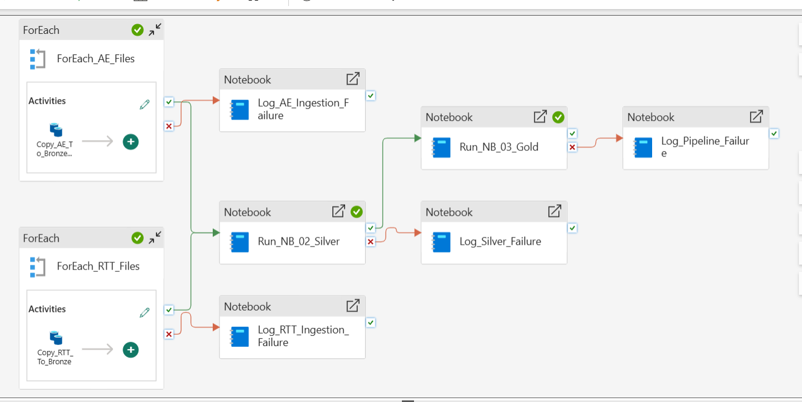

# PL_NHS_Operational_Performance

## Purpose

This Microsoft Fabric Data Factory pipeline orchestrates the ingestion,
transformation, validation, and modelling of NHS operational performance data.

The pipeline processes NHS A&E, RTT waiting-list, and ODS provider-reference
data through a Bronze, Silver, and Gold architecture.

## Pipeline Architecture

## Pipeline Flow

NHS Public Sources
        |
        v
Bronze Ingestion
        |
        v
NB_02_Silver_Transformations
        |
        v
NB_03_Gold_Data_Model
        |
        v
Power BI Semantic Model

Pipeline failures are captured through NB_04_Pipeline_Failure_Log.

## Pipeline Parameters

| Parameter | Type | Purpose |
|---|---|---|
| environment | String | Identifies the deployment environment, e.g. dev |
| load_type | String | Controls the processing mode |
| run_id | String | Uses the Fabric pipeline RunId for execution traceability |

The current implementation uses `load_type = full`, while Delta MERGE operations
provide idempotent processing for the Silver and Gold datasets.

## Bronze Ingestion

Historical NHS source files are ingested into the Lakehouse Bronze layer using
metadata-driven Fabric Data Factory activities.

Example structure:

Files/bronze/ae/YYYY-MM/
Files/bronze/rtt/YYYY-MM/
Files/bronze/ods_api/snapshot_date=YYYY-MM-DD/

A&E historical coverage:
September 2025 - August 2026

RTT historical coverage:
August 2025 - July 2026

Raw source files are retained unchanged in Bronze.

## Silver Processing

`NB_02_Silver_Transformations` performs:

- schema standardisation
- column-name normalisation
- provider-code cleaning
- reporting-month parsing
- NHS provider reference enrichment
- placeholder-to-NULL conversion
- data-quality validation
- business-key validation
- Delta MERGE processing

Silver tables:

- silver_ae_performance
- silver_rtt_waiting_list
- silver_provider_reference

## Gold Processing

`NB_03_Gold_Data_Model` creates the dimensional analytical model.

Dimensions:

- dim_provider
- dim_date
- dim_specialty

Facts:

- fact_ae_performance
- fact_rtt_waiting_list

Analytical table:

- gold_provider_monthly_kpi

Larger fact tables and the KPI table use Delta MERGE operations to support
idempotent reruns.

## Failure Handling

Pipeline failure paths invoke `NB_04_Pipeline_Failure_Log`.

Failure records are written to:

`pipeline_run_log`

The log captures:

- run_id
- environment
- load_type
- pipeline_name
- failed stage
- status
- start/completion timestamps
- error message

Pipeline-level failure logging is used because some Fabric Spark failures can
occur before notebook code starts executing.

## Operational Resilience

During development, a Gold notebook execution encountered a Fabric Spark
capacity/session allocation failure before notebook execution.

The orchestration was subsequently configured to use Fabric high-concurrency
Spark sessions for the Silver and Gold processing stages.

This separates infrastructure/session-allocation failures from transformation
logic failures and provides a realistic operational debugging scenario.

## Idempotency

Silver and Gold fact processing uses Delta Lake MERGE operations based on
defined business keys.

Examples:

A&E:
`reporting_month + provider_code`

RTT:
`reporting_month + provider_code + treatment_function_code`

This allows pipeline reruns without duplicating existing records.

## Observability

Each pipeline execution can be traced using the Fabric pipeline RunId.

Successful and failed processing stages are recorded in `pipeline_run_log`,
providing basic operational monitoring and troubleshooting information.